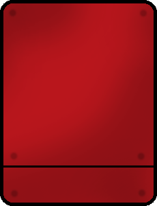
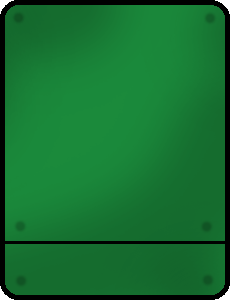
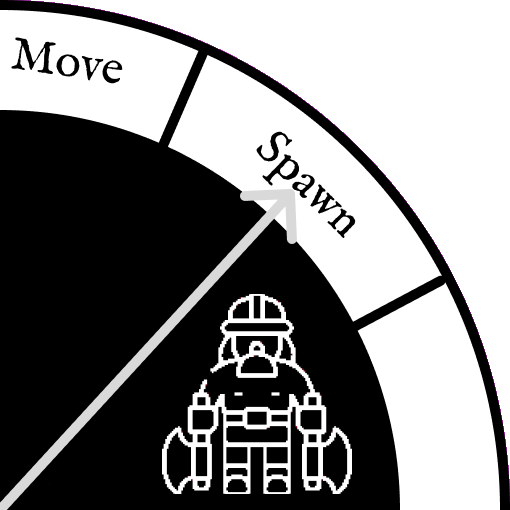

# Graphic Ressources

## A. HUD

This is the final look of our HUD:

 

Action Card:

         

Priority Card:

    

Bottom Layer:

 

Tech Wheel:

 

Event Dial:

    
 

Background:

 

Case Bonus:

 
 

## B. Map

This is the final look of our Map in a middle game exemple with 2 players:

 

Field classic elements:

      
 

Field natural wonder elements:

      

Barbarians:

 

Player pawns:

     

     

     

     
 

Ressource:

    
 

State Cities:

    

